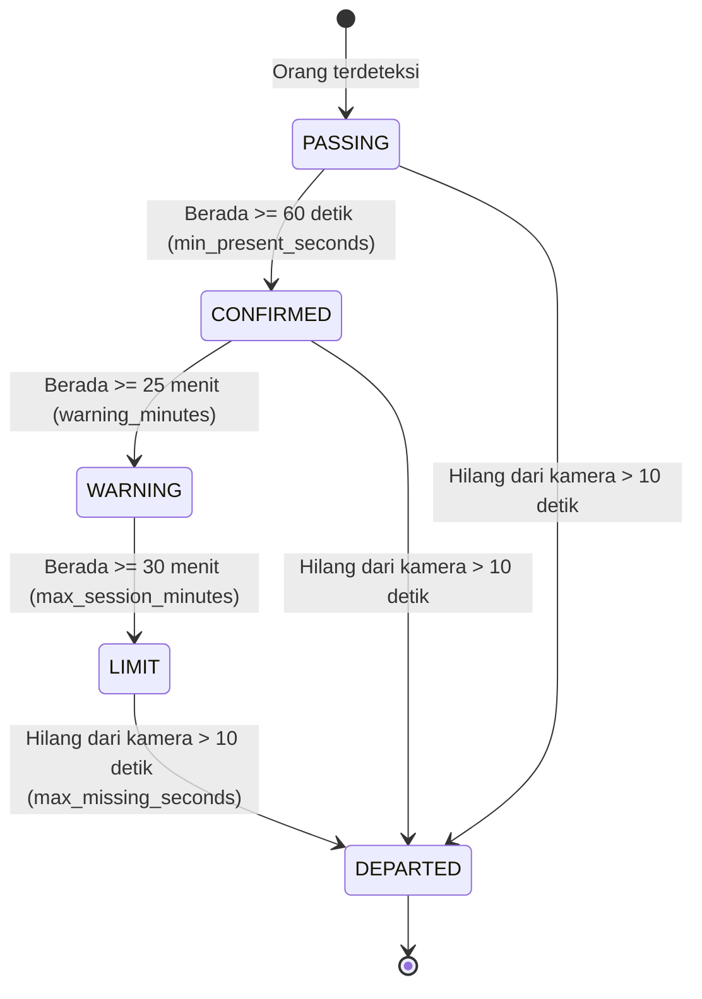

# Panduan Konfigurasi AI Vision Engine (`default_config.yaml`)

Dokumen ini menjelaskan seluruh parameter konfigurasi pada sistem AI Vision Engine, fungsi masing-masing opsi, tipe data, serta rekomendasi pengaturannya.

---

## 1. `core` (Pipeline & Deteksi Objek)

Mengatur sumber video, model detektor orang, pemrosesan frame, dan akselerasi perangkat keras.

| Parameter | Tipe | Contoh Nilai | Deskripsi & Rekomendasi |
| :--- | :--- | :--- | :--- |
| `source_uri` | `string` | `"frontend/public/videos/video2.mp4"` | Sumber input video. Dapat berupa path file lokal (`.mp4`), RTSP URL (`rtsp://ip:port/stream`), webcam index (`"0"`), atau HTTP stream. |
| `source_type` | `string` | `"opencv"` | Tipe frame loader yang digunakan (`"opencv"`, `"video_file"`, `"mock"`). |
| `model_path` | `string` | `"LibreDFINEs.pt"` | Checkpoint model detektor orang. Menggunakan **D-FINE Small** (50.7% mAP, lisensi MIT, Transformer-based). Bobot otomatis diunduh saat pertama kali dijalankan jika belum ada. |
| `detection_interval` | `int` | `1` | Interval eksekusi deteksi objek per frame. Nilai `1` berarti deteksi dijalankan setiap frame. Nilai `2` atau `3` dapat digunakan untuk menghemat beban komputasi CPU. |
| `device` | `string` | `"auto"` | Perangkat inferensi PyTorch. `"auto"` (otomatis memilih CUDA GPU jika tersedia, jika tidak beralih ke CPU), `"cuda"`, `0`, atau `"cpu"`. |
| `target_fps` | `float` | `30.0` | Batas kecepatan frame rate maksimal (FPS throttle) agar pemrosesan berjalan stabil dan tidak membebani sistem secara berlebihan. |
| `enable_profiling` | `bool` | `true` | Mengaktifkan pemantauan latensi dan metrik kinerja (FPS, latency detector, tracker, dan pipeline). |
| `auto_warmup` | `bool` | `true` | Menjalankan satu inferensi dummy di awal saat engine start agar inisialisasi PyTorch/CUDA tidak menyebabkan lag pada frame pertama. |

---

## 2. `face_recognizer` (Pengenalan Wajah Karyawan)

Mengatur plugin deteksi wajah ([SCRFD](file:///c:/Users/FikriAlfathir/Documents/.PerjalananNgoding/Mandiri/AI-Time-Tracking-System/engine/models/detector/scrfd_10g_bnkps.onnx)) dan ekstraksi fitur embedding ([GLINTR100](file:///c:/Users/FikriAlfathir/Documents/.PerjalananNgoding/Mandiri/AI-Time-Tracking-System/engine/models/embedder/glintr100.onnx)) untuk identifikasi identitas karyawan.

| Parameter | Tipe | Nilai Default | Deskripsi & Rekomendasi |
| :--- | :--- | :--- | :--- |
| `detector_model_path` | `string` | `"engine/models/detector/scrfd_10g_bnkps.onnx"` | Path file model SCRFD ONNX untuk mendeteksi wajah dan 5 titik landmark wajah (mata, hidung, sudut bibir). |
| `embedder_model_path` | `string` | `"engine/models/embedder/glintr100.onnx"` | Path file model ArcFace GLINTR100 ONNX untuk menghasilkan vektor embedding wajah 512 dimensi. |
| `employees_dir` | `string` | `"engine/data/employees"` | Direktori tempat foto referensi karyawan disimpan (format: `<nama_atau_id>/photo.jpg`). |
| `embeddings_dir` | `string` | `"engine/data/embeddings"` | Direktori penyimpanan vektor embedding wajah yang sudah dikompilasi sebelumnya (`.npy`). |
| `detector_input_size` | `list[int]` | `[640, 640]` | Resolusi input gambar untuk detektor wajah SCRFD. |
| `detector_confidence_threshold`| `float` | `0.50` | Ambang batas confidence deteksi wajah. Nilai di bawah `0.50` akan diabaikan untuk mencegah false positive. |
| `alignment_output_size` | `list[int]` | `[112, 112]` | Ukuran crop wajah yang telah distandardisasi dan di-align sesuai landmark mata/hidung sebelum masuk ke embedder. |
| `embedding_dimension` | `int` | `512` | Dimensi vektor fitur wajah (512 float values per wajah). |
| `similarity_threshold` | `float` | `0.37` | Cosine similarity threshold untuk mencocokkan identitas. Jika skor kesamaan $\ge 0.37$, wajah dianggap cocok dengan database. |
| `cache_ttl_seconds` | `float` | `60.0` | Masa berlaku (TTL) hasil pengenalan wajah pada track ID yang sama sebelum diverifikasi ulang. |
| `min_confirmations` | `int` | `2` | Jumlah kecocokan wajah berurutan yang diperlukan sebelum sistem mengubah status identitas track menjadi terkonfirmasi. |
| `unknown_retry_interval_sec` | `float` | `1.0` | Interval percobaan ulang pengenalan wajah jika seseorang belum teridentifikasi. |
| `max_unknown_retries` | `int` | `5` | Batas maksimum percobaan cepat pengenalan wajah sebelum beralih ke interval santai (backoff). |
| `backoff_retry_interval_sec` | `float` | `5.0` | Interval jeda percobaan pengenalan wajah setelah batas percobaan cepat terlampaui (menghemat komputasi). |
| `min_person_crop_width` | `int` | `40` | Lebar minimal bounding box tubuh orang (dalam pixel) agar wajah dicoba dideteksi. Mencegah komputasi sia-sia pada orang yang terlalu jauh. |
| `min_person_crop_height` | `int` | `80` | Tinggi minimal bounding box tubuh orang (dalam pixel) agar wajah dicoba dideteksi. |

---

## 3. `attendance` (Status Kehadiran & Aturan Waktu)

Mengatur logika durasi keberadaan, peralihan status kehadiran, batas maksimal sesi di area tertentu (misal entertainment room), dan jam istirahat.

| Parameter | Tipe | Nilai Default | Deskripsi & Logika Bisnis |
| :--- | :--- | :--- | :--- |
| `min_present_seconds` | `float` | `60.0` | Durasi minimal (detik) seseorang berada di area sebelum status berubah dari `PASSING` (hanya lewat) menjadi `CONFIRMED` (hadir/berkegiatan). |
| `warning_minutes` | `float` | `25.0` | Ambang batas durasi (menit) saat status berubah menjadi `WARNING` (peringatan bahwa waktu sesi hampir habis). |
| `max_session_minutes` | `float` | `30.0` | Batas maksimal durasi (menit) yang diperbolehkan di area hiburan/istirahat sebelum status menjadi `LIMIT` (melebihi batas toleransi). |
| `max_missing_seconds` | `float` | `10.0` | Toleransi waktu (detik) saat seseorang hilang dari pandangan kamera (terhalang pilar atau keluar sesaat) sebelum sesinya resmi ditutup sebagai `DEPARTED`. |
| `break_start_hour` | `int` | `12` | Jam mulai istirahat siang (format 24 jam, inklusif). Deteksi kehadiran otomatis dijeda selama jam ini. |
| `break_end_hour` | `int` | `13` | Jam berakhir istirahat siang (format 24 jam, eksklusif). Deteksi kehadiran otomatis aktif kembali pada pukul 13:00. |

---

## 4. `visualizer` (Jendela Debug & OpenCV GUI)

Mengatur tampilan overlay visual jika sistem dijalankan dengan mode visualizer lokal (`--gui`).

| Parameter | Tipe | Nilai Default | Deskripsi |
| :--- | :--- | :--- | :--- |
| `enabled` | `bool` | `true` | Mengaktifkan modul visualizer grafis. |
| `window_name` | `string` | `"AI Vision Engine - Real-Time Tracking"` | Judul jendela pop-up OpenCV GUI. |
| `draw_velocity` | `bool` | `true` | Menampilkan vektor arah pergerakan orang berdasarkan Kalman Filter tracker. |
| `draw_history` | `bool` | `true` | Menampilkan jejak lintasan (*trail history*) pergerakan orang di lantai. |
| `show_metrics_overlay` | `bool` | `true` | Menampilkan HUD metrik performa (FPS, frame count, latency, jumlah orang) di pojok atas layar. |
| `window_scale` | `float` | `1.0` | Faktor skala ukuran jendela GUI (misal `0.75` untuk memperkecil tampilan pada layar laptop beresolusi rendah). |
